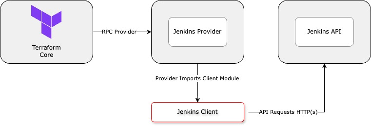

# Jenkins Client (Go)

A Go client package that provides a transient connection between [terraform-provider-jenkins](https://github.com/mjagyo/terraform-provider-jenkins) and [jenkins-api](https://github.com/mjagyo/jenkins-client-go). You do not need to compile this package; the Jenkins provider uses it as a dependency. 

Using this module, the Jenkins provider establishes a new client and sends HTTP(s) requests to the product api application to perform CRUD operations. It also handles data mapping from user's inputs to `models.go`. The Jenkins URL defaults to `http://localhost:8080` and you can configure it [here](https://github.com/mjagyo/jenkins-client-go/blob/main/client.go#L11) in case that port is already in use. This module also handles API calls to create secret, create job and authenticate token.
